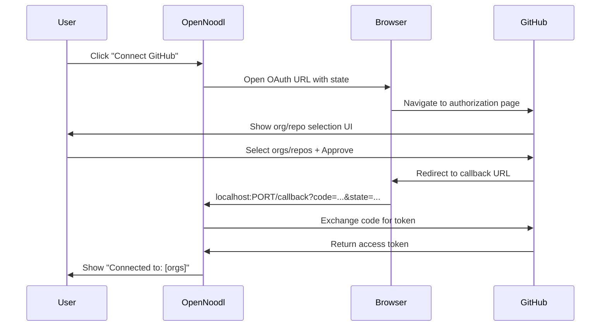

# GIT-004A Phase 5B: Web OAuth Flow for Organization/Repository Selection

**Status:** 📋 **PLANNED** - Not Started  
**Priority:** HIGH - Critical for organization repo access  
**Estimated Time:** 6-8 hours  
**Dependencies:** GIT-004A OAuth & Client Foundation (✅ Complete)

---

## Executive Summary

Upgrade GitHub OAuth authentication from Device Flow to Web OAuth Flow to enable users to select which organizations and repositories they want to grant access to - matching the professional experience provided by Vercel, VS Code, and other modern developer tools.

**Current State:** Device Flow works for personal repositories but cannot show organization/repository selection UI.

**Desired State:** Web OAuth Flow with GitHub's native org/repo selection interface.

---

## The Problem

### Current Implementation (Device Flow)

**User Experience:**

```
1. User clicks "Connect GitHub Account"
2. Browser opens with 8-character code
3. User enters code on GitHub
4. Access granted to ALL repositories
5. ❌ No way to select specific orgs/repos
6. ❌ Organization repos return 403 errors
```

**Technical Limitation:**

- Device Flow is designed for devices without browsers (CLI tools)
- GitHub doesn't show org/repo selection UI in Device Flow
- Organization repositories require explicit app installation approval
- Users cannot self-service organization access

### What Users Expect (Web OAuth Flow)

**User Experience (like Vercel, VS Code):**

```
1. User clicks "Connect GitHub Account"
2. Browser opens to GitHub OAuth page
3. ✅ GitHub shows: "Where would you like to install OpenNoodl?"
   - Select organizations (dropdown/checkboxes)
   - Select repositories (all or specific)
   - Review permissions
4. User approves selection
5. Redirects back to OpenNoodl
6. ✅ Shows: "Connected to: Personal, Visual-Hive (3 repos)"
```

**Benefits:**

- ✅ Self-service organization access
- ✅ Granular repository control
- ✅ Clear permission review
- ✅ Professional UX
- ✅ No 403 errors on org repos

---

## Solution Architecture

### High-Level Flow



### Key Components

**1. Callback URL Handler** (Electron Main Process)

- Registers IPC handler for `/github/callback`
- Validates OAuth state parameter (CSRF protection)
- Exchanges authorization code for access token
- Stores token + installation metadata

**2. Web OAuth Flow** (GitHubAuth service)

- Generates authorization URL with state
- Opens browser to GitHub OAuth page
- Listens for callback with code
- Handles success/error states

**3. UI Updates** (CredentialsSection)

- Shows installation URL instead of device code
- Displays connected organizations
- Repository count per organization
- Disconnect clears all installations

---

## Technical Requirements

### Prerequisites

✅ **Already Complete:**

- GitHub App registered (client ID exists)
- OAuth service layer built
- Token storage implemented
- UI integration complete
- Git authentication working

❌ **New Requirements:**

- Callback URL handler in Electron main process
- OAuth state management (CSRF protection)
- Installation metadata storage
- Organization/repo list display

### GitHub App Configuration

**Required Settings:**

1. **Callback URL:** `http://127.0.0.1:3000/github/callback` (or dynamic port)
2. **Permissions:** Already configured (Contents: R/W, etc.)
3. **Installation Type:** "User authorization" (not "Server-to-server")

**Client ID:** Already exists (`Iv1.b507a08c87ecfe98`)  
**Client Secret:** Need to add (secure storage)

---

## Implementation Phases

### Phase 1: Callback Handler (2 hours)

**Goal:** Handle OAuth redirects in Electron

**Tasks:**

1. Add IPC handler for `/github/callback` route
2. Implement OAuth state generation/validation
3. Create token exchange logic
4. Store installation metadata
5. Test callback flow manually

**Files:**

- `packages/noodl-editor/src/main/github-oauth-handler.ts` (new)
- `packages/noodl-editor/src/main/main.js` (register handler)

### Phase 2: Web OAuth Flow (2 hours)

**Goal:** Replace Device Flow with Web Flow

**Tasks:**

1. Update `GitHubAuth.ts` with web flow methods
2. Generate authorization URL with scopes + state
3. Open browser to authorization URL
4. Listen for callback completion
5. Update types for installation data

**Files:**

- `packages/noodl-editor/src/editor/src/services/github/GitHubAuth.ts`
- `packages/noodl-editor/src/editor/src/services/github/GitHubTypes.ts`
- `packages/noodl-editor/src/editor/src/services/github/GitHubTokenStore.ts`

### Phase 3: UI Integration (1-2 hours)

**Goal:** Show org/repo selection results

**Tasks:**

1. Update "Connect" button to use web flow
2. Display connected organizations
3. Show repository count per org
4. Add loading states during OAuth
5. Handle error states gracefully

**Files:**

- `packages/noodl-editor/src/editor/src/views/panels/VersionControlPanel/components/GitProviderPopout/sections/CredentialsSection.tsx`

### Phase 4: Testing & Polish (1-2 hours)

**Goal:** Verify full flow works end-to-end

**Tasks:**

1. Test personal repo access
2. Test organization repo access
3. Test multiple org selection
4. Test disconnect/reconnect
5. Test error scenarios
6. Update documentation

---

## Success Criteria

### Functional Requirements

- [ ] User can initiate OAuth from OpenNoodl
- [ ] GitHub shows organization/repository selection UI
- [ ] User can select specific orgs and repos
- [ ] After approval, user redirected back to OpenNoodl
- [ ] Access token works for selected orgs/repos
- [ ] UI shows which orgs are connected
- [ ] Git operations work with selected repos
- [ ] Disconnect clears all connections
- [ ] No 403 errors on organization repos

### Non-Functional Requirements

- [ ] OAuth state prevents CSRF attacks
- [ ] Tokens stored securely (encrypted)
- [ ] Installation metadata persisted
- [ ] Error messages are user-friendly
- [ ] Loading states provide feedback
- [ ] Works on macOS, Windows, Linux

---

## User Stories

### Story 1: Connect Personal Account

```
As a solo developer
I want to connect my personal GitHub account
So that I can use Git features without managing tokens

Acceptance Criteria:
- Click "Connect GitHub Account"
- See organization selection UI (even if only "Personal")
- Select personal repos
- See "Connected to: Personal"
- Git push/pull works
```

### Story 2: Connect Organization Account

```
As a team developer
I want to connect my organization's repositories
So that I can collaborate on team projects

Acceptance Criteria:
- Click "Connect GitHub Account"
- See dropdown: "Personal, Visual-Hive, Acme Corp"
- Select "Visual-Hive"
- Choose "All repositories" or specific repos
- See "Connected to: Visual-Hive (5 repos)"
- Git operations work on org repos
- No 403 errors
```

### Story 3: Multiple Organizations

```
As a contractor
I want to connect multiple client organizations
So that I can work on projects across organizations

Acceptance Criteria:
- Click "Connect GitHub Account"
- Select multiple orgs: "Personal, Client-A, Client-B"
- See "Connected to: Personal, Client-A, Client-B"
- Switch between projects from different orgs
- Git operations work for all
```

---

## Security Considerations

### OAuth State Parameter

**Purpose:** Prevent CSRF attacks

**Implementation:**

```typescript
// Generate random state before redirecting
const state = crypto.randomBytes(32).toString('hex');
sessionStorage.set('github_oauth_state', state);

// Validate on callback
if (receivedState !== sessionStorage.get('github_oauth_state')) {
  throw new Error('Invalid OAuth state');
}
```

### Client Secret Storage

**⚠️ IMPORTANT:** Client secret must be securely stored

**Options:**

1. Environment variable (development)
2. Electron SafeStorage (production)
3. Never commit to Git
4. Never expose to renderer process

### Token Storage

**Already Implemented:** `electron-store` with encryption

---

## Known Limitations

### 1. Port Conflicts

**Issue:** Callback URL uses fixed port (e.g., 3000)

**Mitigation:**

- Try multiple ports (3000, 3001, 3002, etc.)
- Show error if all ports busy
- Document how to change in settings

### 2. Firewall Issues

**Issue:** Some corporate firewalls block localhost callbacks

**Mitigation:**

- Provide PAT fallback option
- Document firewall requirements
- Consider alternative callback methods

### 3. Installation Scope Changes

**Issue:** User might modify org/repo access on GitHub later

**Mitigation:**

- Validate token before each Git operation
- Show clear error if access revoked
- Easy reconnect flow

---

## Migration Strategy

### Backward Compatibility

**Current Users (Device Flow):**

- Keep working with existing tokens
- Show "Upgrade to Web OAuth" prompt
- Optional migration (not forced)

**New Users:**

- Only see Web OAuth option
- Device Flow removed from UI
- Cleaner onboarding

### Migration Path

```typescript
// Check token source
if (token.source === 'device_flow') {
  // Show upgrade prompt
  showUpgradePrompt({
    title: 'Upgrade GitHub Connection',
    message: 'Get organization access with one click',
    action: 'Reconnect with Organizations'
  });
}
```

---

## Testing Strategy

### Manual Testing Checklist

**Setup:**

- [ ] GitHub App has callback URL configured
- [ ] Client secret available in environment
- [ ] Test GitHub account has access to orgs

**Personal Repos:**

- [ ] Connect personal account
- [ ] Select personal repos
- [ ] Verify Git push works
- [ ] Verify Git pull works
- [ ] Disconnect and reconnect

**Organization Repos:**

- [ ] Connect with org access
- [ ] Select specific org
- [ ] Choose repos (all vs. specific)
- [ ] Verify Git operations work
- [ ] Test 403 is resolved
- [ ] Verify other org members can do same

**Error Cases:**

- [ ] Cancel during GitHub approval
- [ ] Network error during callback
- [ ] Invalid state parameter
- [ ] Expired authorization code
- [ ] Port conflict on callback
- [ ] Firewall blocks callback

### Automated Testing

**Unit Tests:**

```typescript
describe('GitHubWebAuth', () => {
  it('generates valid authorization URL', () => {
    const url = GitHubWebAuth.generateAuthUrl();
    expect(url).toContain('client_id=');
    expect(url).toContain('state=');
  });

  it('validates OAuth state', () => {
    const state = 'abc123';
    expect(() => GitHubWebAuth.validateState(state, 'wrong')).toThrow();
  });

  it('exchanges code for token', async () => {
    const token = await GitHubWebAuth.exchangeCode('test_code');
    expect(token.access_token).toBeDefined();
  });
});
```

---

## Documentation Updates

### User-Facing Docs

**New Guide:** "Connecting GitHub Organizations"

- How org/repo selection works
- Step-by-step with screenshots
- Troubleshooting common issues
- How to modify access later

**Update Existing:** "Git Setup Guide"

- Replace Device Flow instructions
- Add org selection section
- Update screenshots

### Developer Docs

**New:** `docs/github-web-oauth.md`

- Technical implementation details
- Security considerations
- Testing guide

---

## Comparison: Device Flow vs. Web OAuth Flow

| Feature                | Device Flow  | Web OAuth Flow    |
| ---------------------- | ------------ | ----------------- |
| User Experience        | Code entry   | ✅ Click + Select |
| Org/Repo Selection     | ❌ No        | ✅ Yes            |
| Organization Access    | ❌ Manual    | ✅ Automatic      |
| Setup Complexity       | Simple       | Medium            |
| Security               | Good         | ✅ Better (state) |
| Callback Requirements  | None         | Localhost server  |
| Firewall Compatibility | ✅ Excellent | Good              |
| Professional UX        | Basic        | ✅ Professional   |

**Verdict:** Web OAuth Flow is superior for OpenNoodl's use case.

---

## Timeline Estimate

| Phase                     | Time Estimate | Dependencies |
| ------------------------- | ------------- | ------------ |
| Phase 1: Callback Handler | 2 hours       | None         |
| Phase 2: Web OAuth Flow   | 2 hours       | Phase 1      |
| Phase 3: UI Integration   | 1-2 hours     | Phase 2      |
| Phase 4: Testing & Polish | 1-2 hours     | Phase 3      |
| **Total**                 | **6-8 hours** |              |

**Suggested Schedule:**

- Day 1 Morning: Phase 1 (Callback Handler)
- Day 1 Afternoon: Phase 2 (Web OAuth Flow)
- Day 2 Morning: Phase 3 (UI Integration)
- Day 2 Afternoon: Phase 4 (Testing & Polish)

---

## Next Steps

1. **Review this document** with team
2. **Get GitHub App client secret** from settings
3. **Configure callback URL** in GitHub App settings
4. **Toggle to Act mode** and begin Phase 1
5. **Follow IMPLEMENTATION-STEPS.md** for detailed guide

---

## Related Documentation

- [TECHNICAL-APPROACH.md](./TECHNICAL-APPROACH.md) - Detailed architecture
- [IMPLEMENTATION-STEPS.md](./IMPLEMENTATION-STEPS.md) - Step-by-step guide
- [CHANGELOG.md](./CHANGELOG.md) - Progress tracking
- [GIT-004A-CHANGELOG.md](../GIT-004A-CHANGELOG.md) - Foundation work

---

**Last Updated:** 2026-01-09  
**Author:** Cline AI Assistant  
**Reviewers:** [Pending]
