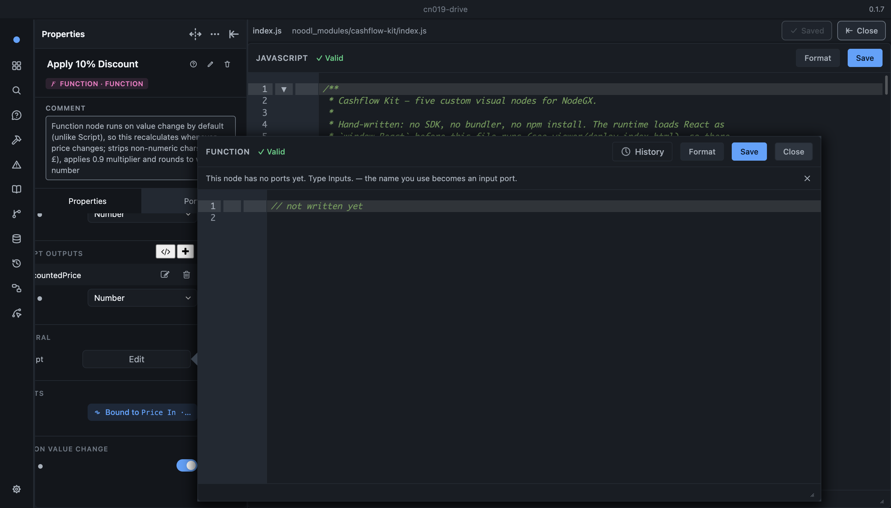
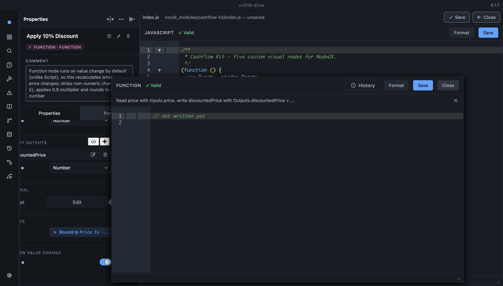

# CN-019 — A file is not a node

| Field | Value |
|---|---|
| **Tier** | 2 |
| **Effort** | S |
| **Surface** | `editor` (`noodl-core-ui`) |
| **Rulings** | ✅ **D1a** — the file editor is a real surface, so it has to be right about what it is showing |
| **Depends on** | CN-006 s10 (`CodeFileDocument`). Nothing depends on this, but **CN-007 does in spirit** |
| **Status** | ✅ **BUILT + DRIVEN s13** — AC1/AC2/AC3/AC4/AC5 met. 🔴 **AC1's second clause was retired by the drive** — see [§The drive](#-driven-2026-08-16-session-13--and-the-first-fix-broke-a-neighbour) |

## Why this exists

Found by driving the editor in **CN-006 s11**. Open a kit's `noodl_modules/<kit>/index.js` through
the new file editor and it tells the author:

> **This node has no ports yet. Type `Inputs.` — the name you use becomes an input port.**

and labels the file **`SCRIPT`** in its toolbar.

**Neither is true.** The file is a whole module, not a node's body; it has no property panel, no
ports, and `Inputs.` is not injected into it. 🔴 **Not cosmetic** — this is the first file a new kit
author is sent to by CN-006's create command, and the first sentence it shows them points at a
mechanism that does not exist there. It teaches the wrong model at the exact moment the phase is
trying to teach the right one, which is also **CN-007's** whole job.

## The mechanism

`CodeFileDocument` reuses `JavaScriptEditor` from `noodl-core-ui` and inherits FUN-006's port bar.

```
KitsSection.tsx:92  openCodeFile(indexPath)
  → CodeFileDocument                                        CodeFileDocument.tsx:79
  → <JavaScriptEditor validationType="script" … />          CodeFileDocument.tsx:241-249
      → modeLabel('script') → "Script" → CSS-uppercased     JavaScriptEditor.tsx:387, modes.ts:19
      → portBarState(validationType, getCodeAuthoringContext().openNode, text)
                                                            JavaScriptEditor.tsx:316
        → barNoPortsMessage()                               portBar.ts:112, notation.ts:508
      → <div className={css['PortHint']} role="status">     JavaScriptEditor.tsx:465-478
```

Two independent causes, and **only the first is the obvious one**:

**(a) `'script'` turns both symptoms on.** `MODES_WITH_DECLARED_PORTS = ['function', 'script']`
(`declaredPorts.ts:167`), so `modeHasDeclaredPorts('script')` is `true` and `portBarState` never
reaches its silent branch. `CodeFileDocument` picked `'script'` deliberately and for a *different*
reason — a module has top-level statements and `'function'` would misparse it
(`CodeFileDocument.tsx:65-77`). Both meanings are riding on one field.

**(b) `openNode` is ambient module state.** `portBarState` takes it from
`getCodeAuthoringContext()` (`authoringContext.ts:241`), a module-level slot whose **only** producer
is the property panel's `CodeEditorType` (`CodeEditorType.ts:365-400`). `CodeFileDocument` never
calls `setOpenNodeContext` — grep returns only `CodeEditorType.ts`. So the bar's answer depends on
what the author last had open:

| ambient slot | what the file is told |
|---|---|
| cleared (a popout closed properly) | `no-ports` → *"Type `Inputs.`"* — **the observed case** |
| still holding a Function node | `unused-ports` → read **that unrelated node's** ports |

🔴 The second is worse than the first and would not be found by re-driving the observed path. The
contract file already warns about exactly this shape (`authoringContext.ts:181-185`: *"a live wrong
answer, not an empty one"*).

## ✅ The precedent is already in the tree, and it names this case

The lint pass met the same problem and solved it — `portDiagnostics.ts:634-641`:

```ts
if (validationType === 'script') {
  // ⚠️ Message 6 needs a node, because the sentence names the Script node's
  // API. 'script' is also `CodeFileDocument`'s mode for a kit's index.js
  // (a whole module, no ports, no property panel), and there `openNode` is
  // null — so that file gets plain `no-undef` on `Outputs`, which is the right
  // answer there and the wrong one to dress up as port advice.
  const onANode = getCodeAuthoringContext().openNode != null;
  if (!onANode) return base;
```

So one surface of this pair is already correct and the other is not. That is the finding in one
line.

⚠️ **But do not just copy the `openNode != null` guard into `portBarState`.** It fixes row 1 of the
table above and *keeps* row 2 — a stale Function node would still supply ports to a file that has
none. Inferring the subject from ambient state is the defect; a better inference is not the fix.

## What to build

**Make the consumer state what it is showing, rather than have the shared component guess.**

1. **An explicit opt-out on `JavaScriptEditor`** — the bar and the mode label are inline JSX inside
   its render (`JavaScriptEditor.tsx:387`, `:465`), so today there is no lever but `validationType`.
   Add one prop that means *"this is a file, not a node's code"*; `CodeFileDocument` sets it.
   - Port bar: silent. Not "empty" — **absent**.
   - Mode label: something true of a file. `SCRIPT` is the Script node's name; the file's own
     extension or a plain `JAVASCRIPT` is honest.
2. **`CodeFileDocument` must not inherit the ambient slot.** Whatever the prop does for rendering, a
   file document should also not be reading a node context it never set. Clearing on open is the
   cheap version; not consulting it at all when the prop is set is the correct one.
3. **Leave `validationType: 'script'` alone.** It is right for the reason it was chosen (parser
   permissiveness) and changing it to fix a label would break parsing to fix a string.

## Acceptance criteria

1. A kit's `index.js` opened through `openCodeFile` shows **no port hint**, with the ambient slot
   **cleared**.
2. A kit's `index.js` opened **immediately after closing a Function node's code popout** shows no
   port hint either. 🔴 **This is the case that separates a real fix from a copied guard** — write it
   before writing the fix.
3. A real Function node's popout still shows the hint, unchanged. *(Control: it is FUN-006's whole
   feature and this task must not retire it.)*
4. The file editor's toolbar does not call a kit module a `SCRIPT`.
5. **Driven, not just unit-tested** — `CodeFileDocument` is a mounted document and the hint is a
   `role="status"` div; assert on the rendered DOM.

## Traps

- 🔴 **Two tests already encode the current behaviour** and will need updating with a reason, not a
  deletion: `noodl-core-ui/tests/code-editor/portBar.test.ts:72` asserts the exact hint string, and
  `declaredPorts.test.ts:228` asserts `modeHasDeclaredPorts('script') === true`. The latter should
  probably stay true — `'script'` genuinely is a ports mode *for a Script node*.
- 🔴 **`BaseDialog` renders every dialog twice.** A DOM assertion for the hint must filter
  `:not([class*=MeasuringContainer])` or it double-counts.
- ⚠️ **`shouldShowBar` retires the bar after N successes and honours a dismissal**
  (`portBar.ts:227-232`). A drive on a machine that has already dismissed it reads as fixed. Assert
  on `portBarState`'s *kind*, or force it, before believing a clean screenshot.
- ⚠️ **The author sees two toolbars** — `CodeFileDocument`'s own `css.Topbar`
  (`CodeFileDocument.tsx:176-206`) sits above `JavaScriptEditor`'s. Worth a look while in here, but
  out of scope unless it is free.

---

## ✅ Built 2026-08-16, session 13

The consumer states its subject; nothing infers it. **~30 lines of product code across five files.**

| File | What changed |
|---|---|
| `utils/types.ts` | `CodeSubject = 'node' \| 'file'`, and `JavaScriptEditorProps.subject` |
| `utils/portBar.ts` | `portBarState(…, subject = 'node')` — `'file'` is `silent` **before anything else is asked** |
| `utils/modes.ts` | `FILE_LABELS`, and `modeLabel(validationType, subject = 'node')` |
| `JavaScriptEditor.tsx` | passes `subject` to the bar, the label and `createExtensions` |
| `codemirror-extensions.ts` | `ExtensionOptions.subject`, threaded into the linter |
| `utils/esLintDiagnostics.ts` · `utils/portDiagnostics.ts` | `subject`, and the pass stands down for a file before anything is asked |
| `CodeFileDocument.tsx` | `subject="file"` — and **nothing else**; see the drive below for what was removed |
| `code-editor/index.ts` | exports the type |

**Both surfaces of the pair have exactly one production caller** (`portBarState`, `modeLabel`), so
the default `'node'` reaches the four property-panel call sites unchanged and no popout moved.

### 🔴 The mutation that matters is the *second* one

Removing the guard is the easy proof and it says little. The proof this task asked for is that the
**copied `openNode != null` guard fails**, and it does — same three new cases, run three ways:

| `portBarState` | AC1 (file, slot clear) | **AC2 (file, slot holds a live node)** | FUN-006's own cases |
|---|---|---|---|
| **as built** (`subject`) | ✅ silent | ✅ silent | ✅ 24/24 |
| **guard deleted** | ✕ *"Type `Inputs.`"* | ✕ *"Read Temperature …"* | ✅ |
| 🔴 **`if (node == null) return silent`** | **✅ silent** | ✕ *"Read Temperature …"* | ✕ **2 broken** |

Row 3 is the finding: the copied guard **passes AC1** and would have shipped. It also breaks two
existing FUN-006 cases, because a blank Function node's `openNode` is real and empty — so the naive
guard does not merely miss the worse row, it retires the feature's whole reason to exist.

⚠️ **AC2's unit form forces the slot rather than closing a popout.** `CodeEditorType#dispose` clears
it on every close path, so *"immediately after closing a Function popout"* is **AC1 in disguise**.
The row that bites is a popout still live, and only a forced slot reaches it.

### Both surfaces of the pair, not just the bar

`subject` is carried into the **lint** pass as well. That was not the first version — the first
version cleared the ambient slot from `CodeFileDocument` instead, which is what the AC asked for and
what the drive below proved wrong. `portDiagnostics`'s own `openNode != null` guard survives inside
the `'script'` branch, where it is still right for its stated reason (message 6 names a node's API),
but it is **no longer what keeps the pass off a file**, and its comment now says so.

### Tests

`tests/code-editor/portBar.test.ts` — a `CN-019` describe of five, including the `?`-button case
(a *suppressed* bar grows a restore control; a *silent* one must not).
`tests/code-editor/modes.test.ts` — AC4, with the popout label as the control on every row.
`tests/code-editor/portDiagnostics.test.ts` — the lint half, each absence beside the identical text
in the identical mode with the subject flipped.
**Full `noodl-core-ui` suite: 477 passed / 26 suites.**

---

## ✅ Driven 2026-08-16, session 13 — and the first fix broke a neighbour

Live editor (`dev:debug`), fixture **`cn019-drive`**: a `cp -R` of `fix016-msg6-drive` (both node
types in one component, so every row runs with no project switch) plus `cn001-kit-drive`'s
`cashflow-kit` under `noodl_modules/`. Identity confirmed by
`ProjectModel.instance._retainedProjectDirectory`, never by component names.

🔴 **The observation was written before the editor was launched.** Both instrument traps it named
fired.

### 🔴 The regression the drive found, which is the reason to have driven it

The first version also cleared the ambient slot on mount, satisfying AC1's *"with the ambient slot
cleared"* literally. **It is wrong, and it was wrong in the direction this whole task is about.**

The comment justifying it said a popout would be *"behind a full-screen surface the author has
navigated away from"*. A code popout is a **portal**. Opening a file leaves it mounted **and on
top** — measured, not assumed: `document.elementFromPoint` at the popout's centre returns an element
inside the popout, and the file editor's centre returns one that is not.

| | the Function popout says |
|---|---|
| before the fix | *"Read `price` with `Inputs.price`, write `discountedPrice` with `Outputs.discountedPrice` = …."* ✅ |
| **with the clearing** | 🔴 *"This node has no ports yet. Type `Inputs.`"* — about a node whose panel, in the same screenshot, lists `price` and `discountedPrice` |



**I had traded one live wrong answer for another**, and the new one was the exact sentence this task
exists to delete, moved one window across. ⚠️ **Note what caused it: fixing a shared component by
writing global state from a consumer** — the same shape as the defect, one layer up.

✅ **The repair is the one the task called correct all along**: `subject` is now carried into the
**lint** pass too (`createExtensions` → `diagnosticsFor` → `javascriptDiagnostics` →
`portDiagnostics`, four signatures, all defaulted to `'node'`), so neither surface consults the
ambient slot for a file, and `CodeFileDocument` writes nothing global. **The clearing is deleted.**

🔴 **AC1's second clause — "with the ambient slot cleared" — is retired, deliberately.** The
replacement is stronger and is what AC2 now asserts: the slot demonstrably **still holds `js`**
while the file editor shows nothing. A cleared slot could not have distinguished the fix from the
guard it was warning about; a populated one does.

### The rows, all read with `alive === true` and the popout's hint beside every absence

| # | editor | port hint | mode label | ambient slot |
|---|---|---|---|---|
| **A** | `index.js` via `openCodeFile`, slot clear | **0** | **JAVASCRIPT** | `null` |
| **B** | `index.js` opened with the popout **still live** | **0** | **JAVASCRIPT** | 🔴 **`js`** |
| **C** | the `JavaScriptFunction` popout (control) | **1** — *"Read `price` with `Inputs.price`, write `discountedPrice` with `Outputs.discountedPrice` = …."* | **FUNCTION** | `js` |



Row B is the whole task in one line: **a non-null, unrelated node in the slot, and no hint.** Row C
is the same component, the same `localStorage`, the same `role="status"` div — so row A/B's zeros
are an absence rather than a dead instrument. No `?` restore button in any row (a *silent* state has
no message to bring back; a merely *suppressed* one would have grown the control).

### And the lint half, as a 2×2 on one instrument

Same text in both editors, read from `forEachDiagnostic` off the live lint state after a settle:

| document | file (`JAVASCRIPT`) | node (`FUNCTION`) |
|---|---|---|
| `Outputs.Total = 1;` | `eslint:no-undef` — *"'Outputs' is not defined."* ✅ | `nodegx:ports` — *"price is declared on this node but never read."* ✅ |

Both non-empty, which is what makes each one evidence. The file gets JavaScript's words about a
name a module genuinely has not defined; the node gets port knowledge. ⚠️ Read **after ~25s**: an
earlier read had both at `0`, and `0` means *"silent"* or *"not linted yet"* indistinguishably.

### 🔴 Two instrument failures, both of which would have produced a passing reading

**1. The bar was already retired on this machine.** `localStorage.codeeditor_portbar_successes` held
`["js", "eeeeeeee…40", "dc5ef4ce…"]` — **three**, and `RETIRE_AFTER_SUCCESSES` is 3, so
`shouldShowBar` was returning `false` for *every* state. Left alone, all four rows read "no hint"
and the drive passes against completely unfixed code. Left over from **FIX-016 s45's** drive: two of
those three ids are the very nodes in this fixture. **Cleared before reading anything, and re-read
on every row** (the reader returns `dismissed`/`successes` every time).

**2. `portBarState.length === 3` is not the version check it looks like.** I reached for arity to
confirm the running renderer had the fix. `Function.length` stops at the first defaulted parameter,
so `subject = 'node'` is invisible and **both versions read 3**. The check that actually
discriminates is behavioural: pre-fix code returns `no-ports` for a file, and it returned `silent`.

⚠️ **And the HMR trap fired on schedule** — editing `codemirror-extensions.ts` mid-drive printed
*"[HMR] Error: Aborted because … is not accepted"*, full-reloaded the renderer, wiped `__req` /
`__cn019` and dropped the editor to the Launcher. Every handle was re-injected and **every row
re-read** against the corrected build; nothing above is a pre-repair reading.
